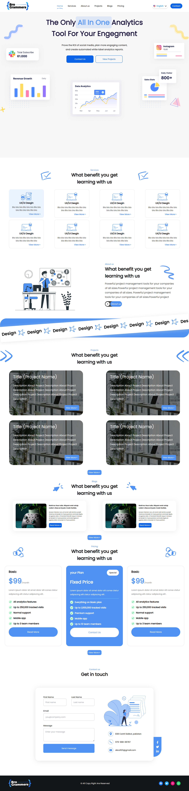
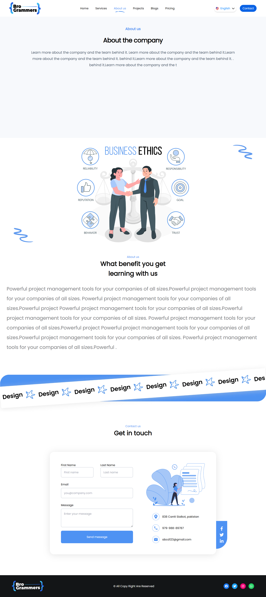
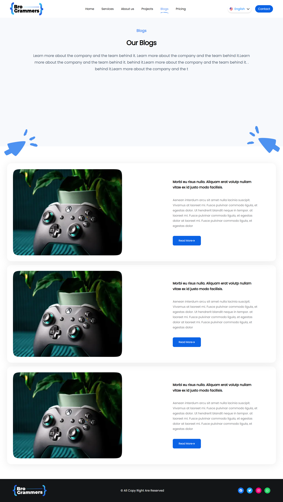
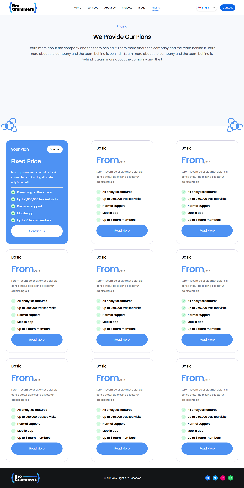
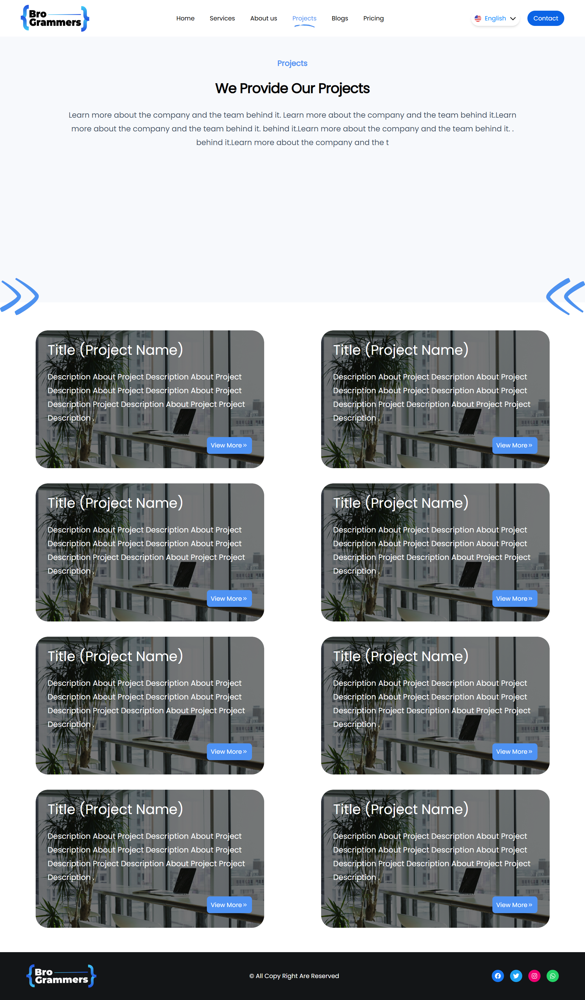
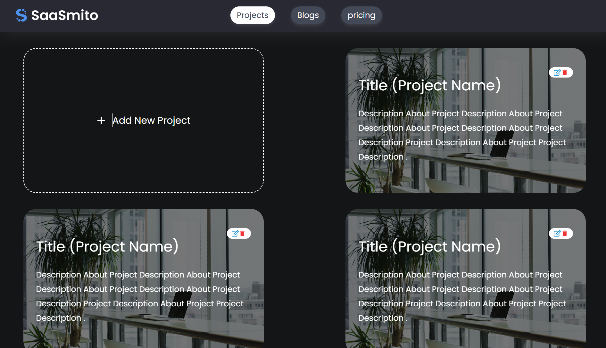
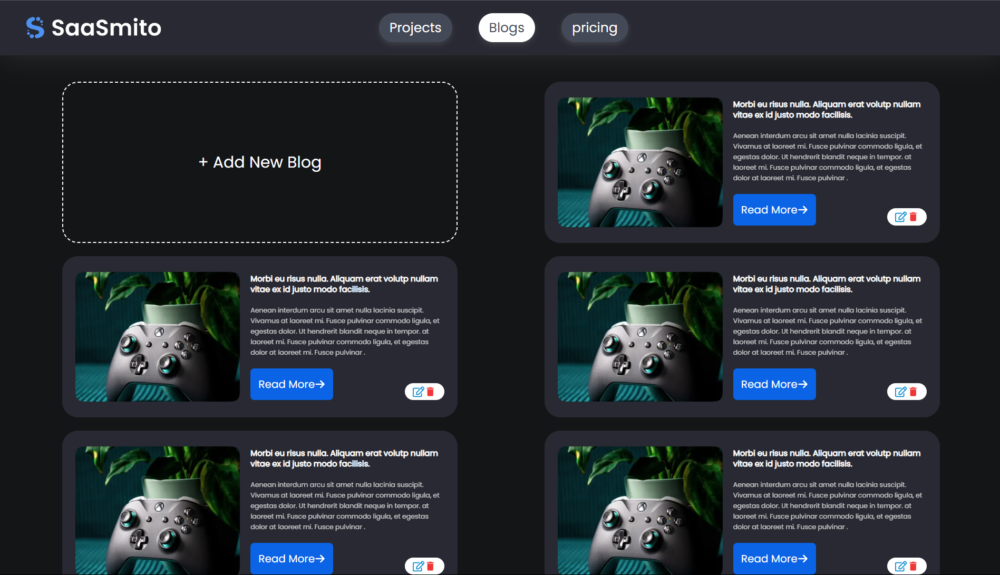
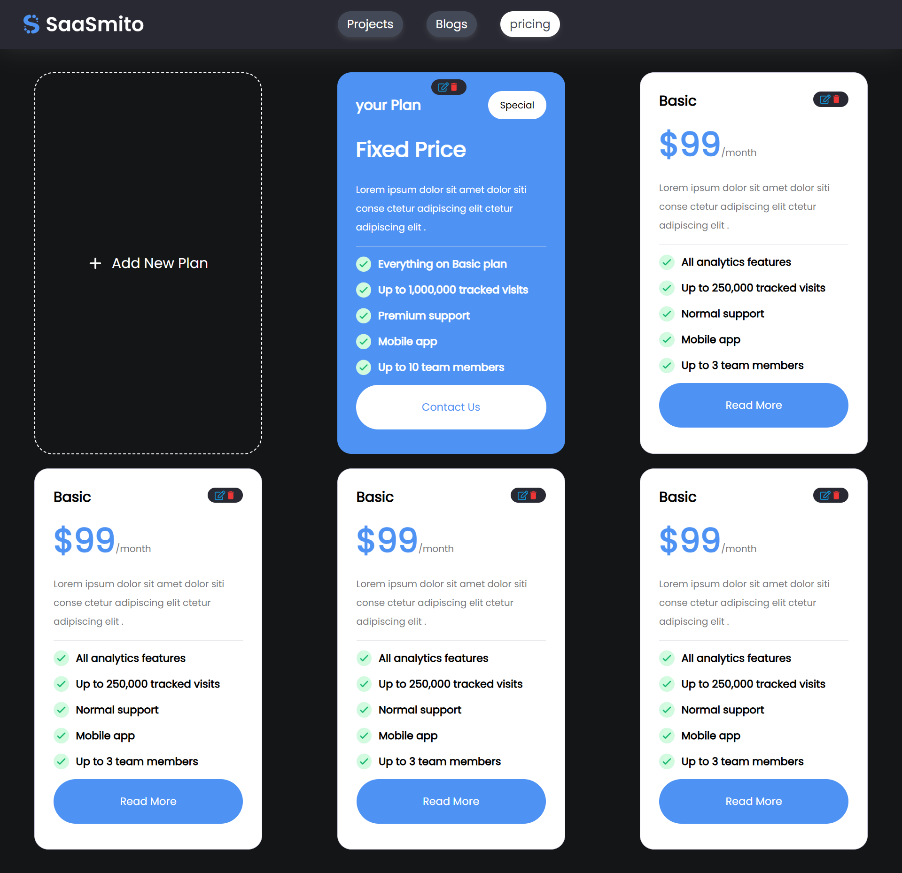

# Bro Grammers


## Table of Contents

- [Screenshots](#screenshots)
- [Features](#features)
- [Installation](#installation)
- [Usage](#usage)
- [Available Scripts](#available-scripts)
- [Project Structure](#project-structure)
- [Configuration](#configuration)
- [Contributing](#contributing)
- [Contact](#contact)

## Screenshots

### Home Page



### About Page



### Blogs Page



### Pricing Page



### Projects Page



### Services Page


### Projects Dashboard Page



### Blogs Dashboard Page



### Pricing Dashboard Page



## Features

- Feature 1: Basic website For Anime Vault

## Installation

### Prerequisites

Make sure you have the following installed:

- Node.js (version 16.0 or higher)
- npm (version 8.0 or higher) or yarn (version 1.22 or higher)

### Steps

1. Clone the repository

   ```bash
   git clone https://github.com/riadosman/anime_app.git
   ```

2. Navigate to the project directory

   ```bash
   cd anime_app
   ```

3. Install dependencies

   ```bash
   npm install
   ```

4. Start the development server

   ```bash
   npm run dev
   ```

5. Open [http://localhost:3000](http://localhost:3000) to view it in the browser

## Usage

### Development

Start the development server:

```bash
npm run dev
```

The app will open in development mode at [http://localhost:3000](http://localhost:3000).

### Production Build

Create a production build:

```bash
npm run build

```

## Available Scripts

In the project directory, you can run:

- `npm start` - Runs the app in development mode
- `npm test` - Launches the test runner
- `npm run build` - Builds the app for production
- `npm run eject` - Ejects from Create React App (one-way operation)

## Project Structure

```
├── .next
├── app
├── screenshots
      ├── admin
      ├── user
  ├── admin
  ├── user
    ├── assets
    ├── components
    ├── dashboard
      ├── blogs
      ├── pricing
      ├── projects
    ├── about-us
    ├── assets
    ├── blogs
    ├── components
    ├── contact
    ├── pricing
    ├── projects
    ├── services
      ├── icons
      ├── [detail]
      ├── [detail]
      ├── [detail]
```

## Configuration

### Package.json Scripts

Custom scripts you can add to your `package.json`:

```json
{
  "scripts": {
    "dev": "next dev -p 4000",
    "build": "next build",
    "start": "next start",
    "lint": "next lint"
  }
}
```

## Contributing

1. Fork the project
2. Create your feature branch (`git checkout -b feature/AmazingFeature`)
3. Commit your changes (`git commit -m 'Add some AmazingFeature'`)
4. Push to the branch (`git push origin feature/AmazingFeature`)
5. Open a Pull Request

## Testing

```bash
# Run tests
npm test
# or
yarn test

# Run tests with coverage
npm test -- --coverage
```

## Built With

- [React](https://reactjs.org/) - The web framework used
- [Create React App](https://create-react-app.dev/) - React toolchain
- [Next js](https://nextjs.org/) - The React Framework for the Web
- [React Router](https://reactrouter.com/) - For routing (if used)

## Contact

Riad osman - riyados973@gmail.com

Project Link: [https://github.com/riadosman/anime_app](https://github.com/riadosman/anime_app)
